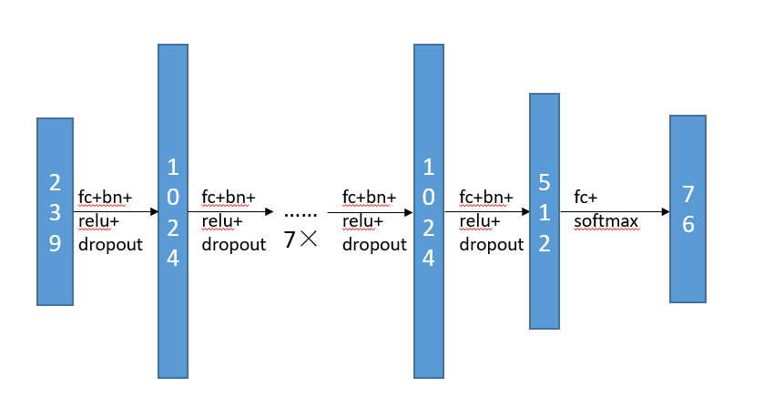
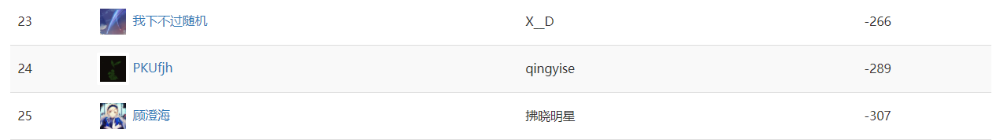
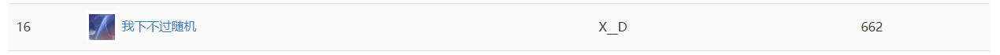

## 国标麻将AI报告

1600012911 李拙 1600012435 吴宜谦

### 序言

国标麻将是麻将的一种玩法，其规则为中国国家体育总局于1998年7月所制定，其后在众多国际及国内麻将竞赛中应用。国标麻将为了增加竞技性、减少随机成分，将番种增加至81种，并设置为**8番起和**。

由于麻将的随机成分大，且往往具有赌博性质，麻将竞技的普及程度远不如棋类比赛，目前对麻将AI的设计的研究也不充分，且以**日本麻将**为主。

我们从**专家系统**和**深度学习**两个角度出发，设计了两个不同的国标麻将AI，分析了国标麻将AI设计的难点。

### 国标麻将

近年来对博弈游戏的人工智能研究取得了很大进展，尤其在Atari游戏和围棋(Go)中，强化学习崭露头角。游戏AI对机器学习的研究起到了很大的推动作用。但是这些游戏抽象的模型过于简单，与现实生活中的问题相差较远，很难有更大的作用。

相比之下，麻将给游戏AI设计带来了新的挑战：

* 麻将是**Multi-agent**游戏，非1v1
* 麻将是**非完全信息**博弈，牌堆和其他玩家的手牌不可见
* 麻将游戏的**状态数**远大于其他牌类游戏

随时间推移，在世界范围内有各种不同的麻将变体，其中日本麻将比较流行，这里我们研究的是规则有一些区别的国标麻将。

从人类的角度出发，国标麻将可分为两个策略：**进攻**与**防守**。

进攻是指玩家以尽快和牌为目标的游戏策略；而防守需要对对手进行建模，评估对手的状态，避免打出可能给对手带来收益的手牌。我们总结国标麻将AI需要的能力如下：

1. 根据当前的手牌状态，决定之后游戏的策略、和牌的目标

   这是国标麻将AI设计中最难的一点。给定当前状态，AI需要决定和牌目标。麻将有很大的的状态空间，AI可以以一定规则进行搜索并以概率最大（或期望收益最高）的和牌牌型为目标决策。但由于国标麻将8番起和的限制和对手行为的不确定性，准确的概率估计变得很难。这个能力比较像AI的大局观，对整体局势的把握，对游戏最终目标的估计。

2. 选择打出的手牌

   打出手牌是一局游戏中出现次数最多的行为，选择打出的手牌也是最基础的能力。这个能力是AI的即时决策，AI应该在（1）的宏观指导下完成即时的决策。

3. 对吃、碰、杠的选择

   麻将的摸牌比较随机，无法预料会得到什么牌。相比之下， 对吃、碰、杠的选择更加可控，在对手打出需要的牌时，正确地做出选择很重要。与（2）相同，这也是AI的即时决策。

4. 评估对手

   由于防守需要，AI必须估计对手的状态，推测对手可能需要的牌，并避免打出这些牌。这一点是麻将防守能力的体现。国标麻将败者的负收益至少是-8（非点炮），这使得和牌的收益更高，而即使没有点炮也需要付出代价。所以国标麻将中进攻所处的地位更高，**防守能力更不重要**。

### 专家系统

在设计基于学习方法的AI前，我们先编写了简单的基于规则的AI作为baseline.

这个AI没有考虑防守，宏观策略由一个手牌估值函数确定，选择打出手牌、吃、碰、杠都基于这个估值函数。估值函数表示手牌与构成四个顺子或刻子和一对将牌的接近程度。

将42种牌分别编码到一个整数，靠近的牌的编码距离为1.然后可以将手牌编码为$3k+2$个整数。

假设手牌为$s_0,s_1,s_2,..,s_{3k+1}$，估值函数$f$定义如下：
$$
f(S) = max_{\pi}\Sigma_{i=0}^{k-1}g(s_{\pi(3i)},s_{\pi(3i+1)},s_{\pi(3i+2)})+h(s_{\pi(3k)},s_{\pi(3k+1)})
$$
其中$\pi$是一个排列
$$
g(a,a+1,a+2)=g(a,a,a)=3 \\
g(a,a+1,b)=g(a,a+2,b)=0\\
h(a,b)=1_{a==b}
$$
估值函数$f$将手牌每3张分成一组，对顺子和刻子有3分的奖励，对可能形成顺子的牌奖励两分，剩余的两张牌形成一堆将牌则奖励2分。

对估值函数的计算就是一个约束优化问题，我们采用了随机初始化然后局部贪心的求解方法，而且输入规模比较小，求最优解的效率很高。具体算法可见代码。

这样
$$
可以和牌\Leftrightarrow f(S)=3k+2
$$
从之前探讨的麻将AI能力的角度来看：

1. 对局势的评价由估值函数反映，和牌目标为与使$f$最大化的划分最接近的和牌牌型
2. 选择打出手牌由估值函数决定，AI从对$g$和$h$没有贡献的牌中选择一张打出
3. 对吃、碰、杠的选择同样由估值函数决定，如果动作可以增大估值函数，那么进行操作
4. 该AI没有对防守的考虑

总的来说，这个AI的规则就是向和牌一步贪心，在凑牌型方面效果还不错。但是AI的弱点也比较明显：没有考虑8番起和。这经常导致牌型够和但是番数不够的情况。另一点是没有考虑防守，可能容易点炮。

在这些约束下，这个简单的专家系统的AI表现并不好是可以预见的，但是这个工作给了我们一个baseline--基于这个简单规则的AI的大致水平。

### 深度学习

由于我们本身并不擅长国标麻将，对国标麻将的理解基本不超过规则，之后我们采取了深度学习的方法训练一个Agent.我们利用人类对局数据进行监督学习，使AI在不同情况下做出正确的决策。深度学习得到的模型没有我们认为的干预，只要提取的特征、训练数据和模型强度是充分大的，AI就会具有应该的进攻和防守能力。

**数据采集**

我们选取了助教提供的50万局人类玩家的对战数据，对局的质量未知，通过只选取其中和牌人的行为序列，可以使数据质量有一些保证。对每个对局，我们按时序恢复了对局情况，记录和牌人的每一个决策和决策时的可观测状态。

**特征提取**

麻将对局中，玩家的可观测状态有：自己的手牌，四个玩家的副露（即进行吃、碰或明杠后展示出来的牌），以及所有玩家打出过的牌。我们认为，相比之下，行为的时许带来的影响并不大（存在一定影响），为了简化输入，便没有考虑时序信息。所以只需对这些数据进行统计。

对于手牌、副露和打出的牌，我们都用一个34维的向量统计每张牌（不考虑花牌）的对应数目，这样得到9个34维的向量。为了强化吃、碰、杠的信息，我们增加了每个玩家已经进行的吃、碰、杠操作数，共$3*4=12$维。再加上上一个玩家打出的牌（进行吃、碰、杠决策时需要使用）的one-hot表示，输入一共352维。

**模型设计**

我们对打牌、吃、碰、杠各设计了一个分类器，打牌的操作是选择一张牌打出，所以是34分类器（然后过滤自己没有的牌），碰和杠都是2分类器，而选择吃时吃的牌的相对位置有3种，所以吃是4分类器。

对于暗杠和补杠，我们发现人类对局中通常会在可以杠时留一段时间再杠，这样会产生不平衡的0-1label，所以我们决定这部分使用自定义规则决策。

模型的结构是简单的多层前馈神经网络（FFN）。由于输入维数比较小，为了避免过拟合，最开始我们采用的网络较小，参数比较少。之后加入了过拟合的措施后，我们增大了网络，效果有一些提升。

**模型细节**

这里只描述打牌模型的结构，其他几个模型结构相似，只是参数更少。

我们的模型结构与下图相似（各层大小略有不同）：

图片来源：罗睿轩

为防止过拟合，受到罗睿轩同学的启发，我们采用Batch Normalization和Dropout(0.3)。

* 模型结构：318 -> 1024 -> 1024 -> 1024 -> 1024 -> 1024 -> 100 -> 34
* 代价函数：CrossEntropy
* 优化器：AdamOptimizer(lr=0.001, betas=(0.9, 0.999))
* Batchsize：1024
* Epochs：400

最后在训练集上的准确率为70.3%，在测试集上的拟合结果为69%，拟合效果良好。

**其他工作**

在这些工作完成后，考虑到杠的训练数据较少，我们又尝试了迁移学习，将打牌模型的前几层权重迁移到杠模型中，但结果并没有显著提升。

### 实验结果

基于专家系统的AI在天梯表现惨淡，偶尔能和几盘，经常点炮。

最初训练出的的深度学习模型（模型小，参数少）表现稍好，但也不佳。下图是模拟赛7中的截图。我们的AI排在23名和25名，这个AI在11次模拟赛中平均得分为-206，基本处于最后几名。

在分析了一些对局之后，我们认为AI的总体表现尚可，大多数时候的决策都是合理的，因此我们认为目前的方法是正确的，训练集和提取的特征有效，缺陷在于决策准确率还不够高。

之后我们增加了防止过拟合的方法，增大了模型，在测试集上的准确率提升了2.5%。但这2.5%的提升，在后来的比赛中发挥了明显的效果，在44人的最终比赛中获得了16名：

这再次验证了我们的想法，人类对局数据是有效的，如果能较好地拟合人类玩家的决策，AI的水平也会有一些提升。

### 相关工作和未来工作

Mizukami, et. al. 在[2]中将麻将AI分为两个部分：单人游戏决策和对手建模。他在对手建模时，用Logistic回归预测对手是否在听牌，再用另一个模型预测对手和的牌是什么。此外，他们还用一个模型预测一个玩家最终的和牌番数。最终他们结合模型进行蒙特卡洛搜索，得到最终的决策。

Gao et. al. 在[3]中的工作和我们十分类似，他们训练了Discard, Pon, Chi三个网络，但他们选取的特征与我们有一些差别，他们还使用了CNN搭建模型。从结果来看，Discard Network和我们的准确率是接近的，这让我们猜测，对于麻将游戏，受到人类玩家的决策失误、输入信息对局面表示有所欠缺等因素的影响，Top1准确率在不能达到非常高是固有的。但在这个背景下，提高一些正确率对AI的表现是有显著的提升的。

我们未来的工作主要有：将时序信息纳入考虑范围，变换输入信息的结构，采用LSTM、CNN等网络结构，提高准确率。另外，受到罗睿轩同学的启发，我们也将考虑设计End-to-end的网络，将打牌、吃、碰、杠决策合并，去除主观因素，让AI完成全部决策。

除监督学习外，强化学习也是一个可行的思路，我们拟采用自对弈的方式进行强化学习，不断迭代提升模型性能。但考虑到麻将随机因素太大，区分实力相近的玩家需要的局数非常多的情况，强化学习难收敛是主要的挑战。

### 参考文献

[1] AI Mahjong - CS229 by WJ Loh @Stanford University

[2] Mizukami, Naoki, and Yoshimasa Tsuruoka. "Building a computer Mahjong player based on Monte Carlo simulation and opponent models." *2015 IEEE Conference on Computational Intelligence and Games (CIG)*. IEEE, 2015.

[3] Gao, Shiqi, et al. "Supervised Learning of Imperfect Information Data in the Game of Mahjong via Deep Convolutional Neural Networks." (2018).

[4] Li, Sanjiang, and Xueqing Yan. "Let's Play Mahjong!." *arXiv preprint arXiv:1903.03294* (2019).
