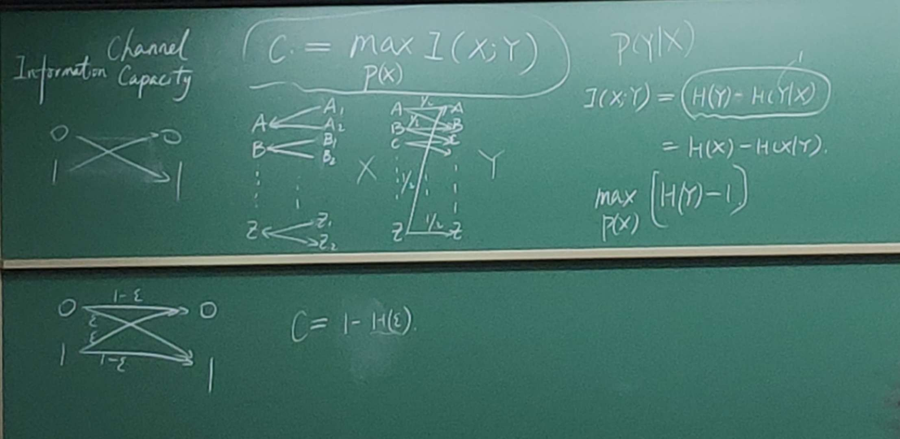
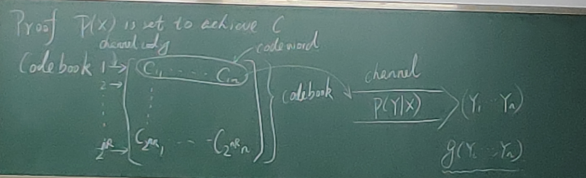

### Lec11-Channel Capacity

1. Implementation (algorithm)

   Encoding/Decoding      constraint: $err \rarr 0$, efficiency

2. Conceptual

* **Def**: (Channel Capacity) $:=\ max_{P(X)}I(X;Y)$

**AEP**: Asymptotic Equipartition property

**The Law of Large Number**:

$P(|\frac1n\Sigma_{i=1}^nX_i-EX|\ge\epsilon) \rarr 0$

if $g(X)$ subject to some property(e.g. like random variable):

$P(|\frac1n\Sigma_{i=1}^ng(X_i)-Eg(X)|\ge\epsilon) \rarr 0$

$g(X) = -log \ p(X)$

$P(2^{-n(H(x)+\epsilon)} \le P(X_1,X_2,\dots,X_n) \le 2^{-n(H(x)-\epsilon)}) \rarr 1$

$P(X_1,\dots,X_n) \approx 2^{-nH(X)}$ with high probability

**Typical Sequence & Set**:

$X_1,\dots,X_n$ is a typical sequence if $P(X_1,\dots,X_n) \in 2^{-n[H(X)\pm\epsilon]}$

Typical set  = {typical sequence}

$P(X_1,\dots,X_n)\approx 2^{-nH(X)}$

So $|typical\ set| \approx 2^{nH(X)}$

So we can assume that all sequences are uniformly distributed in typical set.

**Jointly Typical Sequence & Set**

$(X,Y), (X_1,Y_1), \dots , (X_n,Y_n)$

// $P(|\frac1n\Sigma_{i=1}^n-logP(X_i,Y_i)-H(X,Y)|\ge\epsilon) \rarr 0$

$|-\frac1n\Sigma_ilogP(X_1,\dots,X_n;Y_1,\dots,Y_n)-H(X;Y)| \le \epsilon$

$|-\frac1n\Sigma_ilogP(X_1,\dots,X_n)-H(X)| \le \epsilon$

$|-\frac1n\Sigma_ilogP(Y_1,\dots,Y_n)-H(Y)| \le \epsilon$

Jointly Typical Sequence.

1) $P(X_1,Y_1,...,X_n,Y_n) \approx 2^{-nH(X,Y)}$

2) $P(X_1,\dots,X_n) \approx 2^{-nH(X)}$

3) $P(Y_1,\dots,Y_n) \approx 2^{-nH(Y)}$

*Random draw of jointly typical sequence*

1) $(x_i,y_i) \sim P(X,Y)$

2) $x_i \sim P(X), y_i \sim P(Y|X_i)$

Q: On average, for each typical sequence $(X_i,\dots,X_n)$, # of $(X_i,Y_i,\dots,X_n,Y_n)$ with sequence $X$ is $2^{nH(Y|X)}$.

*Random draw*

$X_1,\dots,X_n \sim P(X)$	$Y_1,\dots,Y_n \sim P(Y)$

Q: On average, the probability that $(X_1,Y_1,\dots,X_n,Y_n)$ is a jointly typical sequence is $2^{-nI(X,Y)}.$

**Setting**

Channel $P(Y|X)$

Input	$X_1,X_2,\dots,X_n$	iid discrete

Input	$Y_1,Y_2,\dots,Y_n$	iid discrete

$W=\{1,2,\dots.n\}$	message (uniform)

Coding:	$W \rarr \cal{X}^n$		$log\ m/n$ bits per trans

Decoding:	$g:\ Y^{(n)} \rarr W$

Error rate: $Pr[g(Y^n)\ne w|X_n=X_n(w)]$

$M=2^{nR}$ keeps efficiency $R$.

If $lim_{n\rarr\infty}\lambda_{max}=0$, $\lambda_{max}=max_{i\in[2^{nR}]}\lambda_i$

**Thm (Channel Coding Thm)**

$C = max_{P(X)}I(X;Y)$

If $R < C$, then, $\exist$ a sequence of $(2^{nR},n)$ codes, such that $lim_{n\rarr\infty}\lambda^{(n)}_{max}=0$.

If $R > C$, then there is no coding method such that $lim_{n\rarr\infty}\lambda^{(n)}_{max}=0$.

$P(X)$ is set to achieve $C$.

1) Random endoding

​	$c_{ij} \sim P(X)$ iid for all $i,j$

2) Decoding

​	On receiving $Y_1,\dots,Y_n$, if there exists a unique codeword $c_{i1},\dots,c_{in}$, such that $(c_{i1},\dots,c_{in};Y_1,\dots,Y_n)$ is a jointly typical sequence, then decode $g(Y_1,\dots,Y_n)$ as $i$, else report a failure. 

*Error probability*

* Y is not a typical sequence. -- low
* X,Y is not a jointly typical sequence. -- low
* $\exist X' s.t. (X',Y)$ is jointly typical sequence. -- $2^{-nI(X;Y)}$

3) From average err. to max err.

**Proof**

* Part I

$R < C$, $P(X) = argmax_{P(X)}I(X;Y)$

Average err over all codebooks and messages:

$P(Err) = \Sigma_{CB}P(CB)\frac1{2^{nR}}\Sigma_{i=1}^{nR}P_e^{CB}(w_i) = \frac1{2^{nR}}\Sigma_{i=1}^{nR}\Sigma_{CB}P(CB)P_e^{CB}(w_i)$

$P(Err) = \Sigma_{CB}P(CB)P_e^{CB}(w_i) \le \epsilon + \epsilon + 2^{-nI(X;Y)} * 2^{nR} = \epsilon' +  2^{-n(C-R)}$

Therefore, there exists a CodeBook such that error prob over all messages is small.

For any message, consider the best half CodeBooks $2^{nR-1}$, there is $max_{i\in {[2^{nR-1]}}}\lambda_i \le 2\epsilon$.

$(2^{n(R-\frac1n)}, n)$

* Part II

Fano's Inequality

$P_e \ge \frac{H(X|Y)-1}{log|\cal{H}|}$

$R > C$, r.v. $W\in_R{1,2,\dots,2^{nR}}$	$X->Y$

$nR = H(W) = H(W|Y_1,\dots,Y_n) + I(W;Y_1,\dots,Y_n)$

$nR \le P_e^{(n)}nR + 1 + I(X_1^n;Y_1^n) = P_e^{(n)}nR + 1 + nC$

$P_e^{(n)}$ cann't goes to $0$.

