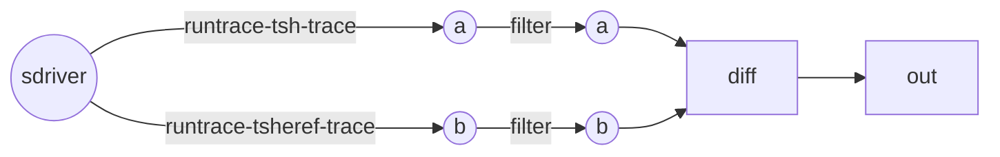
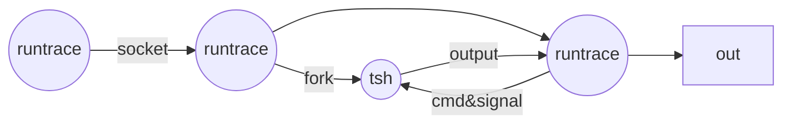
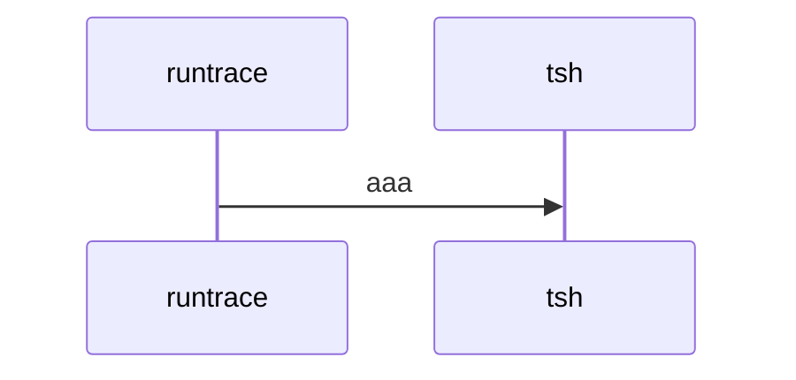

#### 运行方式

* docker
* notify -- bomb

#### 提交 & 验证

* json对象 / code style
* trace / sim

#### 代码分析

#### 项目目标

* 进度 & 计划
Pipe

* 分工

bug -- not closing fd of builtin-cmd redirection
add pipe
trace -- fix echo "|" to "\0174"

增加管道实现

	

修改trace中 /bin/echo 的参数 | 为 \0174
修复tshref中在builtin_command中重定向打开的文件描述符没有关闭的bug

redo
fix bug - fix trace                             -- \???    fake tsh youdiandongxi.... additional quote
tsh fork pipe children? or child          -- tsh fork
jobs -> jid&pid?                                -- pids
FG -- wait for who?                             -- all

fix pipes

check traces

don't use pipes with built-in commands simutaneously
job state is "Running" if running process numbers isn't zero
// ignore sigpipe

fix code to more robust

bug: pkill trace10      -- fixed by '/usr/bin/pkill -u $USER' :tsh should support ENV

/bin/ls | /bin/sleep 10
pkill sleep error?      // if process whose pid is pgid exits, kill(-pgid, xxx) will fail

sigtstp to all children

code to trace26 with bugs? -- fix by synchronize with SIGUSR1

pids[0] -> 0  -- fgpid bugs -- add pgid in job entry to fix

diff pids with problem  -- modify PRELPROG to ignore anything between '()'

0. Report
1. Documentation
2. Code
3. Grades

````mermaid
graph LR
  tsh1((tsh> ))
  tsh2((tsh> ))
  child1((child))
  tsh1-->tsh2
  tsh1--fork-->child1
  child1--fork-->a((a))
  child1--fork-->b((b))
  child1--fork-->c((c))
  a-->b
  b-->c
  
````

````mermaid
graph LR
  tsh1((tsh> ))
  tsh2((tsh> ))
  tsh1-->tsh2
  tsh1--fork-->a((a))
  tsh1--fork-->b((b))
  tsh1--fork-->c((c))
  a-->b
  b-->c
````

````mermaid
graph LR
  tsh1((tsh> ))
  tsh2((tsh> ))
  a((a))
  aa((a))
  b((b))
  bb((b))
  c((c))
  cc((c))
  tsh1-->tsh2
  tsh1--fork-->a
  tsh1--fork-->b
  tsh1--fork-->c
  a--setpgid-0-0-->aa
  aa-->bb
  b--setpgid-0-pid0-->bb
  bb-->cc
  c--setpgid-0-pid0-->cc
  
````







